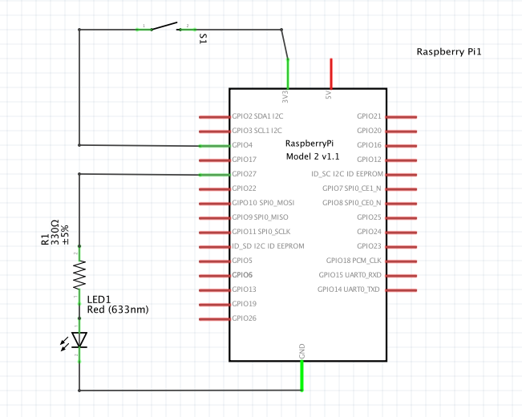
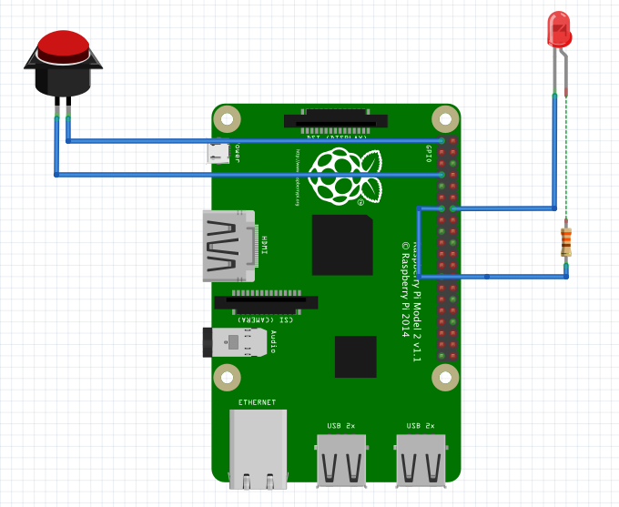

# Some basic GPIO examples with Raspberry Pi

## Hardware

Push button:

 - pin 7 (GPIO 4)
 - pin 1 (3V3)

LED:

 - pin 13 (GPIO 27)
 - pin 14 (GROUND)

 
## Software

### RPi.GPIO

https://sourceforge.net/p/raspberry-gpio-python/wiki/Home/

- without interrupts: [RPi_GPIO_no_interrupts.py](RPi_GPIO_no_interrupts.py)

- with interrupts: ToDo

### Pingo

http://www.pingo.io/

#### Pins

 - without interrupts: [pingo_pins_no_interrupts.py](pingo_pins_no_interrupts.py)

 - with interrupts: ToDo

#### Parts

 - with interrupts

   - [pingo_parts_toggle.py](pingo_parts_toggle.py)
   - [pingo_parts_record.py](pingo_parts_record.py)

### pigpio

http://abyz.co.uk/rpi/pigpio/python.html

### wiringpi

http://wiringpi.com/

https://github.com/WiringPi/WiringPi-Python

## See also

http://rpitips.com/python-libraries-rpi-gpio/

